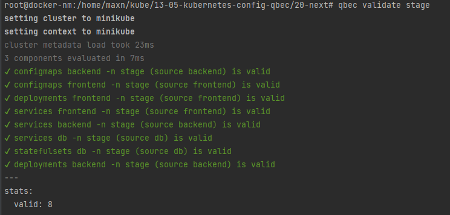

# 13-05-kubernetes-config-qbec

## Stage

Проверка stage




Результат создания stage

```shell
root@docker-nm:/home/maxn/kube/13-05-kubernetes-config-qbec/20-next# qbec apply  stage
setting cluster to minikube
setting context to minikube
cluster metadata load took 26ms
3 components evaluated in 7ms

will synchronize 8 object(s)

Do you want to continue [y/n]: y
3 components evaluated in 5ms
create configmaps backend -n stage (source backend)
create configmaps frontend -n stage (source frontend)
create deployments backend -n stage (source backend)
create deployments frontend -n stage (source frontend)
create statefulsets db -n stage (source db)
create services backend -n stage (source backend)
create services db -n stage (source db)
create services frontend -n stage (source frontend)
server objects load took 805ms
---
stats:
  created:
  - configmaps backend -n stage (source backend)
  - configmaps frontend -n stage (source frontend)
  - deployments backend -n stage (source backend)
  - deployments frontend -n stage (source frontend)
  - statefulsets db -n stage (source db)
  - services backend -n stage (source backend)
  - services db -n stage (source db)
  - services frontend -n stage (source frontend)

waiting for readiness of 3 objects
  - deployments backend -n stage
  - deployments frontend -n stage
  - statefulsets db -n stage

✓ 0s    : deployments backend -n stage :: successfully rolled out (2 remaining)
✓ 0s    : statefulsets db -n stage :: 1 new pods updated (1 remaining)
  0s    : deployments frontend -n stage :: 0 of 1 updated replicas are available
✓ 1s    : deployments frontend -n stage :: successfully rolled out (0 remaining)

✓ 1s: rollout complete
command took 4.92s


```

Проверка stage со стоорны пользователя


Список ресурсов


Пример deployment backend

```shell
root@docker-nm:/home/maxn/kube/13-05-kubernetes-config-qbec/20-next# kubectl describe deploy backend
Name:                   backend
Namespace:              stage
CreationTimestamp:      Sat, 23 Apr 2022 10:36:35 +0000
Labels:                 app=backend
                        qbec.io/application=13-05-qbec
                        qbec.io/environment=stage
Annotations:            deployment.kubernetes.io/revision: 1
                        qbec.io/component: backend
                        qbec.io/last-applied:
                          H4sIAAAAAAAA/3RRPW/bMBDd+zNupiuprodyqgt3KGAUQptkCYzgRF0cwuSRIWklhsH/HlB2DCWAJ534Ht8H7wjo9R2FqB2DBPQ+VkMDAnaae5CwIm/cwRInEGApYY8JQR4BmV3CpB...
Selector:               app=backend
Replicas:               1 desired | 1 updated | 1 total | 1 available | 0 unavailable
StrategyType:           RollingUpdate
MinReadySeconds:        0
RollingUpdateStrategy:  25% max unavailable, 25% max surge
Pod Template:
  Labels:  app=backend
  Containers:
   backend:
    Image:      maxnelipin/13-backend:latest
    Port:       9000/TCP
    Host Port:  0/TCP
    Environment:
      DATABASE_URL:  postgres://postgres:postgres@db:5432/news
    Mounts:          <none>
  Volumes:           <none>
Conditions:
  Type           Status  Reason
  ----           ------  ------
  Available      True    MinimumReplicasAvailable
  Progressing    True    NewReplicaSetAvailable
OldReplicaSets:  <none>
NewReplicaSet:   backend-7f4cf7c666 (1/1 replicas created)
Events:          <none>

```

## Prod

Проверка prod


Результат создания prod

```shell
root@docker-nm:/home/maxn/kube/13-05-kubernetes-config-qbec/20-next# qbec apply prod
setting cluster to minikube
setting context to minikube
cluster metadata load took 23ms
4 components evaluated in 5ms

will synchronize 10 object(s)

Do you want to continue [y/n]: y
4 components evaluated in 9ms
create configmaps backend -n prod (source backend)
create configmaps frontend -n prod (source frontend)
create endpoints twogisgeo -n prod (source twogisgeo)
create deployments backend -n prod (source backend)
create deployments frontend -n prod (source frontend)
create statefulsets db -n prod (source db)
create services backend -n prod (source backend)
create services db -n prod (source db)
create services frontend -n prod (source frontend)
create services twogisgeo -n prod (source twogisgeo)
server objects load took 804ms
---
stats:
  created:
  - configmaps backend -n prod (source backend)
  - configmaps frontend -n prod (source frontend)
  - endpoints twogisgeo -n prod (source twogisgeo)
  - deployments backend -n prod (source backend)
  - deployments frontend -n prod (source frontend)
  - statefulsets db -n prod (source db)
  - services backend -n prod (source backend)
  - services db -n prod (source db)
  - services frontend -n prod (source frontend)
  - services twogisgeo -n prod (source twogisgeo)

waiting for readiness of 3 objects
  - deployments backend -n prod
  - deployments frontend -n prod
  - statefulsets db -n prod

✓ 0s    : statefulsets db -n prod :: 1 new pods updated (2 remaining)
  0s    : deployments frontend -n prod :: 0 of 3 updated replicas are available
  0s    : deployments backend -n prod :: 0 of 3 updated replicas are available
  1s    : deployments backend -n prod :: 1 of 3 updated replicas are available
  2s    : deployments frontend -n prod :: 1 of 3 updated replicas are available
  2s    : deployments backend -n prod :: 2 of 3 updated replicas are available
  3s    : deployments frontend -n prod :: 2 of 3 updated replicas are available
✓ 3s    : deployments backend -n prod :: successfully rolled out (1 remaining)
✓ 4s    : deployments frontend -n prod :: successfully rolled out (0 remaining)

✓ 4s: rollout complete
command took 12.14s

```

Проверка prod со стоорны пользователя


Список ресурсов


Пример deployment frontend

```shell
root@docker-nm:/home/maxn/kube/13-05-kubernetes-config-qbec/20-next# kubectl describe deploy frontend
Name:                   frontend
Namespace:              prod
CreationTimestamp:      Sat, 23 Apr 2022 12:22:18 +0000
Labels:                 app=frontend
                        qbec.io/application=13-05-qbec
                        qbec.io/environment=prod
Annotations:            deployment.kubernetes.io/revision: 1
                        qbec.io/component: frontend
                        qbec.io/last-applied:
                          H4sIAAAAAAAA/3SRQesTMRDF736MOafuliJobooehCKLohcpMs1ObWgyE5PpYin57pKt/7IUelo27+W932SugMn/oFy8MFjAlEo3rcHAyfMIFj5SCnKJxAoGIimOqAj2CsgsiuqFS/...
Selector:               app=frontend
Replicas:               3 desired | 3 updated | 3 total | 3 available | 0 unavailable
StrategyType:           RollingUpdate
MinReadySeconds:        0
RollingUpdateStrategy:  25% max unavailable, 25% max surge
Pod Template:
  Labels:  app=frontend
  Containers:
   frontend:
    Image:      maxnelipin/13-frontend:latest
    Port:       80/TCP
    Host Port:  0/TCP
    Environment:
      BASE_URL:  http://backend:9000
    Mounts:      <none>
  Volumes:       <none>
Conditions:
  Type           Status  Reason
  ----           ------  ------
  Available      True    MinimumReplicasAvailable
  Progressing    True    NewReplicaSetAvailable
OldReplicaSets:  <none>
NewReplicaSet:   frontend-cccd99989 (3/3 replicas created)
Events:
  Type    Reason             Age   From                   Message
  ----    ------             ----  ----                   -------
  Normal  ScalingReplicaSet  35m   deployment-controller  Scaled up replica set frontend-cccd99989 to 3

```

